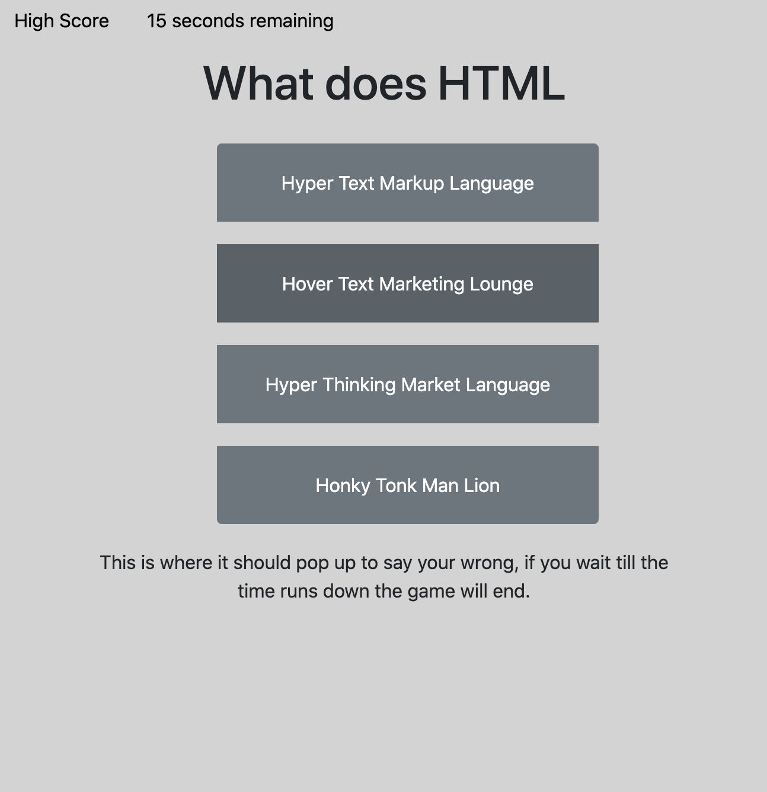
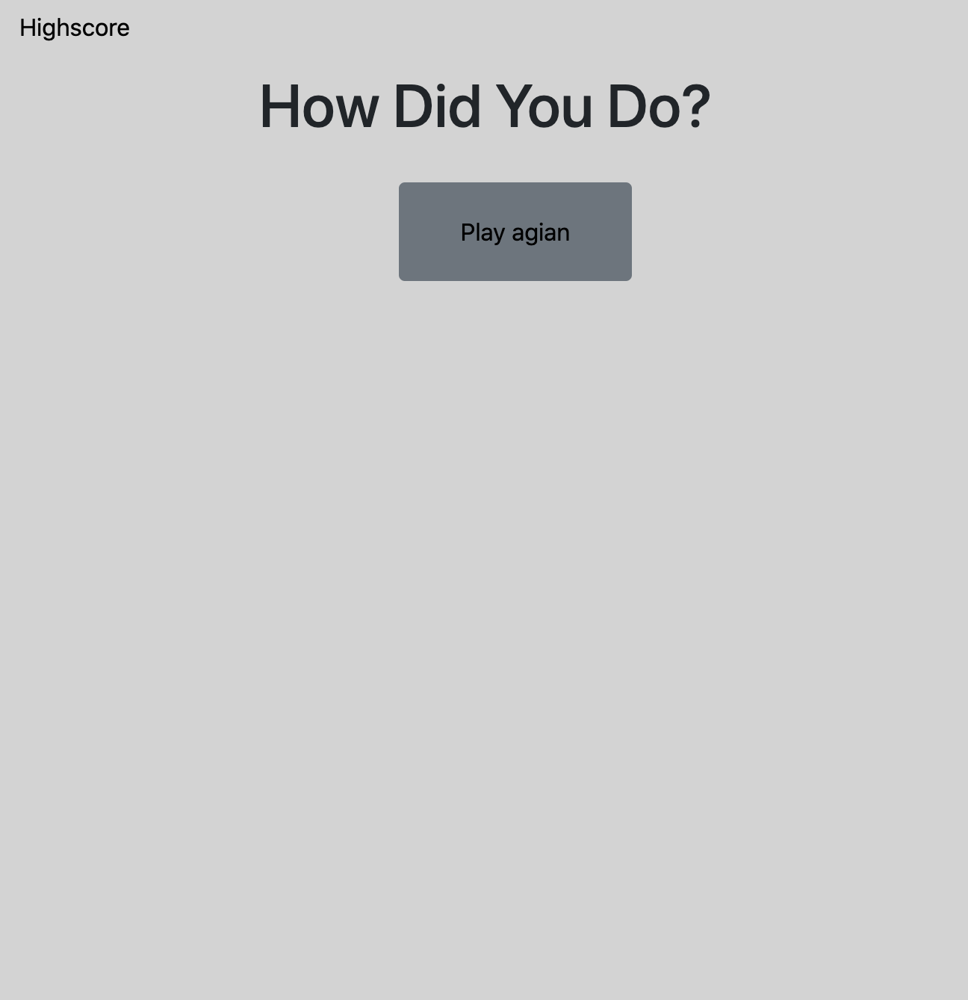

# Quiz Show 
## Homework 4
## David Bushard
 

For this assinment I needed to create a quiz game. I have 5 questions that kind of make sence. i was tasked to have the time be the score and to go through the quiz. 

 

## What I did.
* I used HTML, CSS and JavaScript to create this project. 

 
 

# Critiria for Assignment. 

* I am taking a code quiz
* I click the start button
* A timer starts and I am presented with a question
* After answering a question I am presented with another question
* I answer a question incorrectly and time should have been subtracted from the clock
* After all questions are answered or the timer reaches 0 the game is over
* after the game is over I can save my initials and my score

 

Links to Repo and Live Page:

### https://github.com/DavidBuoy/CodeQuizShow

### https://davidbuoy.github.io/CodeQuizShow/

 
 

# Screenshots & Gif

 
 

